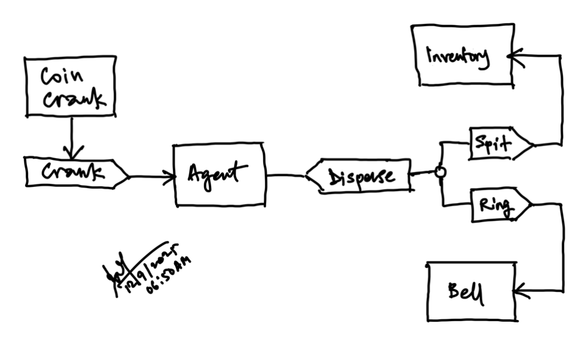

> [home](../)

## Introduction

The most fundamental idea in computing is one of input, process and output.
Any entity can be thought of as a processor.
It can also be viewed from an anthropomorphic perspective.
Why not consider each entity as an agent that responds to stimuli.
Then we can explore the behaviroal aspects of the agent as a stimulus response
organism — a la B.F. Skinner (Behavioral Psychologist).

It helps to remember the seminal definition of Artificial Intelligence put forth by
Alan Turing.  If you can't distinguish between the agent and a human — both of them
placed in a black box scenario — based on input and output (stimulus and response),
the agent is considered intelligent.

Now, we can look at any black box system as a Stimulus Response System (SRS &#x1F609;).
Let's begin calling the stimuli by another name — triggers — an we are in business
with events.  An event encapsulates a trigger and a response togther into a
convenient abstraction.

> An event describes a trigger with a response to that trigger.
> The response may also invoke other triggers in turn.
> The event is complete when no more triggers are invoked by the response.

Suppose we — as in the good old days — slide a quarter into a vending machine
(VM &#x1F609;) and pull a crank and get a can of Coke&trade; out.
Let's assume that the only product dispensed by the VM is Coke&trade;.

* The trigger is the pull of the crank.
* The VM responds by spitting out a can of Coke&trade; and ringing a bell.
* The intelligence inside the VM is an agent.
* It gets triggerred by the pull on the crank.
* The agent then triggers the dispenser to spit out a can of Coke&trade;
* It also triggers the bell to ring!

We can now capture a useful acronym to to summarize what an event is:

> An EVENT is a tuple: Trigger, Agent, Response (TAR).

Now, we are in business.  We have the essence of a sort of fractal — a pattern that
repeats itself however deep you go.  We can capture any action inside the system
as an EVENT.

* A button press is an event.
* A customer order is an event.
* A customer payment is an event.
* A product shipment is an event.
* A use case is an event.
* A function call is also an event!
* A clock cycle is an event!

> It's turtles all the way down!
> How cool is that!

PS: If you're curious as to what happened to the SIMS at SLIIT, let me be brief.
They outsourced the project to a reputed local company for multiple millions.
After about 3 years, they abandoned the project.
Then they went into a venture with an Indian company to modify an already
existing SIMS app to suit their needs.
After about 4 years and wasting yet multiple millions, that also folded.
Now — in 2025 — they are kind of back at square one.
Ahem, actually worse:  they have hired an outside development team and running
the project themselves.

> If they only bothered to capture what they needed to build and had a decent
> high-level view!

Here, I am offering hope!
